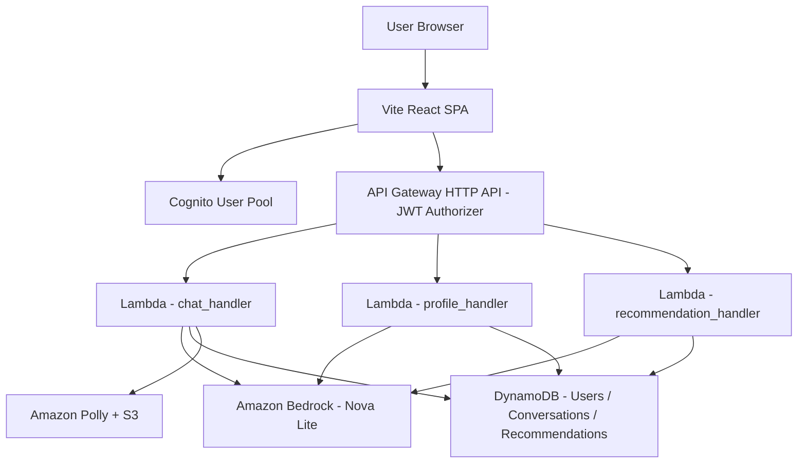

# Design Document: ET AI Concierge

## Overview
ET AI Concierge is a full-stack AI assistant for the Economic Times ecosystem. It onboards users via chat, builds a financial profile, and produces personalized ET product recommendations. The system is built with a Vite/React frontend and a serverless AWS backend (Lambda + API Gateway) using Amazon Bedrock for AI inference, DynamoDB for persistence, and Cognito for authentication.

## Architecture
### High-Level


### Deployment
- Frontend: Vite build deployed on AWS Amplify (or any static host)
- Backend: AWS SAM/CloudFormation template provisions Lambda, API Gateway, DynamoDB, S3 (Polly), and Cognito JWT authorizer
- Shared Bedrock logic is packaged as a Lambda Layer (`bedrock_client.py`)

## Backend Components
### chat_handler (POST /chat)
Responsibilities:
1. Read Cognito userId from JWT claims
2. Load conversation history + user profile from DynamoDB
3. Determine onboarding vs concierge mode based on profile completeness
4. Call Bedrock with a structured JSON prompt
5. Persist conversation and optional profile update
6. Optionally synthesize audio via Polly when `voiceEnabled=true`

Request:
```json
{ "message": "Hi", "conversationId": "optional-uuid", "voiceEnabled": false }
```

Response:
```json
{
  "reply": "...",
  "response": "...",
  "user_type": "New User",
  "conversationId": "...",
  "actions": [
    {"title":"ET Markets","description":"...","cta":"Explore","target":"markets","url":"https://..."}
  ],
  "onboardingComplete": false,
  "audioUrl": null,
  "profile": {"profession":"student", "financialGoals":["..."], ...}
}
```

### profile_handler (GET/PUT /profile)
- GET returns user profile (auto-creates a user on first GET)
- PUT accepts either `conversationId` (extract from conversation) or explicit `profile`

### recommendation_handler (GET /recommendations, POST /recommendations/refresh)
- GET returns stored recommendations or defaults
- POST refreshes recommendations via Bedrock and stores them

### bedrock_client (Lambda Layer)
- `invoke_chat()` for chat responses
- `extract_profile()` for profile extraction
- `generate_recommendations()` for recommendations
- Includes JSON validation + Decimal-safe serialization

## Frontend Components
- Auth via `react-oidc-context` using Cognito Hosted UI
- Main tabs: Chat, Dashboard, Profile, and ET product pages
- Chat UI supports STT (Web Speech API) and TTS (Polly audio + browser fallback)
- Dashboard shows profile summary and recommendations

## Data Models
### Users Table
```json
{
  "userId": "...",
  "email": "...",
  "createdAt": 1712345678,
  "onboardingComplete": false,
  "profile": {
    "profession": "student",
    "financialGoals": ["..."],
    "investmentExperience": "beginner",
    "incomeRange": "...",
    "riskAppetite": "moderate",
    "userType": "Student Saver"
  }
}
```

### Conversations Table
```json
{
  "userId": "...",
  "conversationId": "...",
  "messages": [
    {"role":"user","content":"...","ts":1712345678},
    {"role":"assistant","content":"...","ts":1712345680}
  ],
  "updatedAt": 1712345690
}
```

### Recommendations Table
```json
{
  "userId": "...",
  "generatedAt": 1712345700,
  "recommendations": [
    {"title":"ET Prime","category":"ET Prime","description":"...","cta":"Try Free","url":"https://...","relevanceScore":0.9}
  ]
}
```

## Key Flows
- Onboarding: Chat ? Bedrock ? profile_update ? Dashboard refresh
- Concierge: Profile-aware responses + action buttons ? navigate to ET pages
- Recommendations: Triggered on-demand from dashboard

## Security
- All API endpoints protected by Cognito JWT authorizer
- UserId derived from JWT `sub` claim only
- Secrets in environment variables; no hardcoded keys
