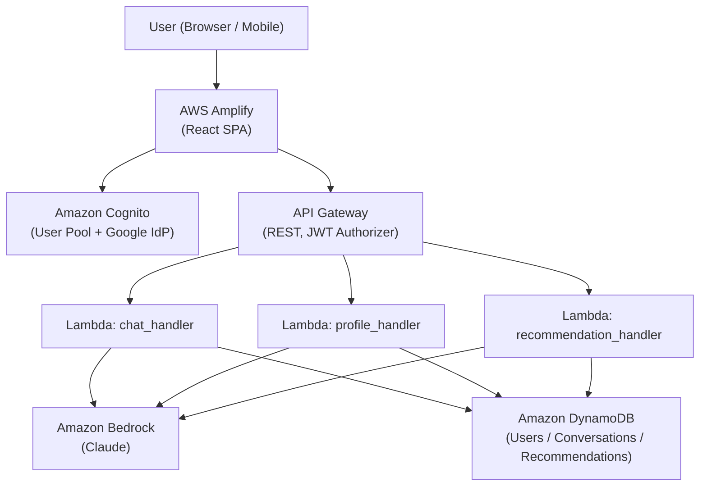
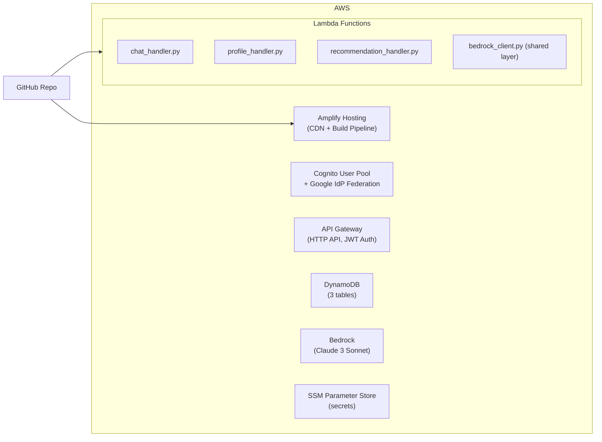
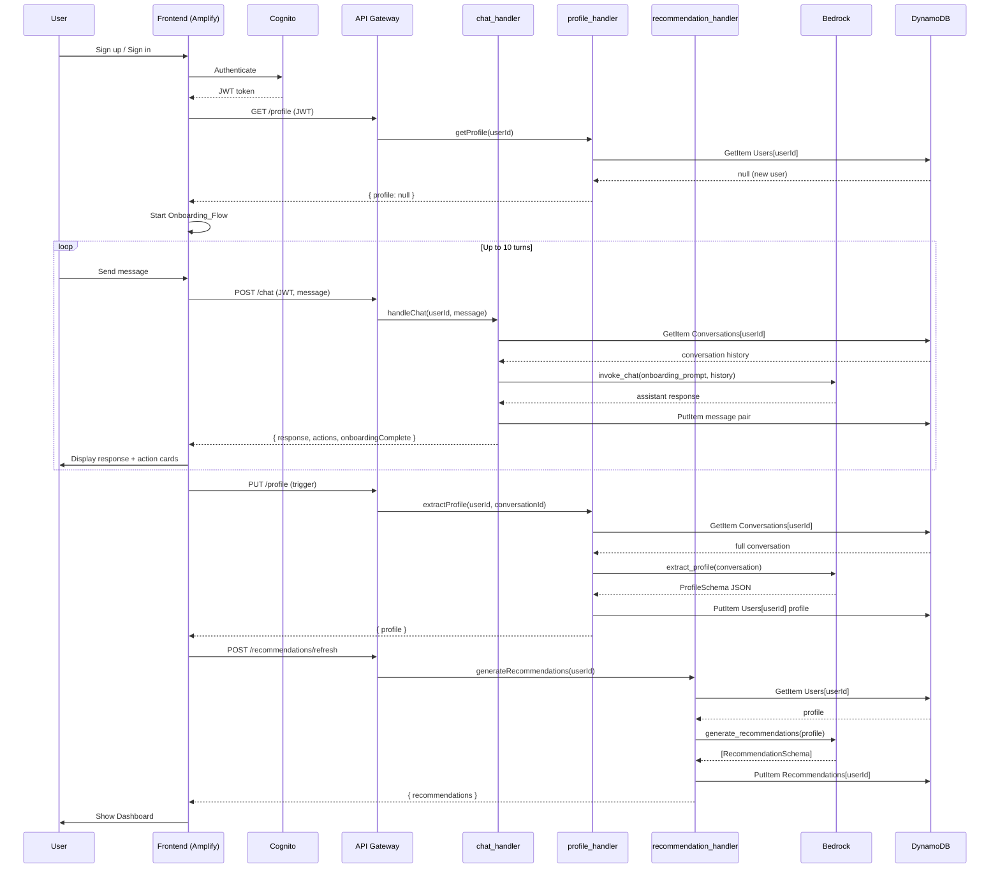
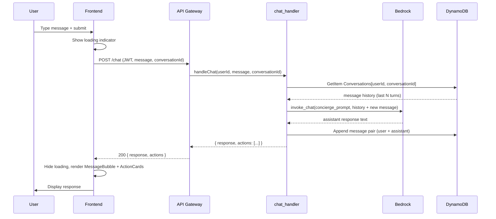
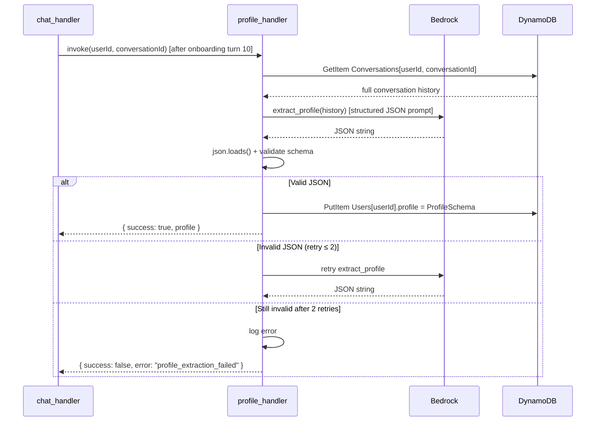

# Design Document: ET AI Concierge

## Overview

ET AI Concierge is a full-stack, serverless AI application that acts as a personalized guide to the Economic Times (ET) ecosystem. It greets users with a structured profiling conversation, extracts a financial profile, and maps users to relevant ET products and partner services.

The system is composed of:
- A React single-page application (SPA) deployed on AWS Amplify
- A Python serverless backend on AWS Lambda, exposed via API Gateway
- Amazon Bedrock for AI inference (Claude model)
- Amazon DynamoDB for persistent storage
- Amazon Cognito for authentication (email/password + Google OAuth)

Key design goals:
- All AI inference is structured and JSON-validated before use
- All user data is scoped by authenticated userId from Cognito JWT
- Secrets are never hardcoded; all config comes from environment variables or SSM Parameter Store
- Frontend and backend are fully decoupled via a documented REST API

---

## Architecture

### High-Level Architecture



### Deployment Architecture



All Lambda functions share a common `bedrock_client` module deployed as a Lambda Layer.

---

## Components and Interfaces

### Backend Components

#### `chat_handler` (Lambda)

Handles `POST /chat`. Responsible for:
1. Validating the JWT (via API Gateway authorizer) and extracting `userId`
2. Loading conversation history from DynamoDB
3. Detecting if the user is in the Onboarding_Flow (turn count < 10, profile not yet extracted)
4. Constructing a system prompt (onboarding or general concierge mode)
5. Invoking `bedrock_client.invoke_chat()` with conversation history
6. Persisting the new message pair to DynamoDB
7. Returning the assistant response plus optional action metadata

Interface:
```python
# Input event (from API Gateway)
{
  "userId": str,          # extracted from JWT by authorizer
  "body": {
    "message": str,       # user's message text
    "conversationId": str # optional; created if absent
  }
}

# Output
{
  "statusCode": int,
  "body": {
    "response": str,
    "conversationId": str,
    "actions": [          # 0–3 action items
      {"label": str, "url": str}
    ],
    "onboardingComplete": bool
  }
}
```

#### `profile_handler` (Lambda)

Handles `GET /profile` and `PUT /profile`. Responsible for:
1. `GET`: Returning the stored Profile for the authenticated user
2. `PUT` (internal trigger or explicit call): Invoking `bedrock_client.extract_profile()` on the full conversation history, validating the JSON output, and persisting to DynamoDB

Interface:
```python
# GET /profile output
{
  "statusCode": 200,
  "body": {
    "userId": str,
    "profile": ProfileSchema  # see Data Models
  }
}

# PUT /profile input (internal trigger from chat_handler post-onboarding)
{
  "userId": str,
  "conversationId": str
}
```

#### `recommendation_handler` (Lambda)

Handles `GET /recommendations` and `POST /recommendations/refresh`. Responsible for:
1. `GET`: Returning persisted recommendations for the user (or defaults if no profile)
2. `POST /refresh`: Invoking `bedrock_client.generate_recommendations()` with the user's profile, validating output, persisting to DynamoDB

Interface:
```python
# GET /recommendations output
{
  "statusCode": 200,
  "body": {
    "userId": str,
    "recommendations": [RecommendationSchema],  # 3–10 items
    "generatedAt": str  # ISO timestamp
  }
}
```

#### `bedrock_client` (Shared Lambda Layer)

Wraps all Amazon Bedrock invocations. Provides three functions:

```python
def invoke_chat(system_prompt: str, messages: list[dict]) -> str:
    """Invoke Bedrock for conversational response. Returns assistant text."""

def extract_profile(conversation_history: list[dict]) -> dict:
    """Invoke Bedrock with profile extraction prompt. Returns validated ProfileSchema dict.
    Retries up to 2 times on non-JSON response. Raises BedrockJSONError on failure."""

def generate_recommendations(profile: dict) -> list[dict]:
    """Invoke Bedrock with recommendation prompt. Returns validated list of RecommendationSchema.
    Retries up to 2 times on non-JSON response. Raises BedrockJSONError on failure."""
```

All structured-output functions (`extract_profile`, `generate_recommendations`) validate JSON before returning and retry up to 2 times on malformed responses.

### Frontend Components

```
src/
  components/
    Auth/
      LoginPage.tsx         # Cognito Hosted UI or Amplify Auth UI
      ProtectedRoute.tsx    # Redirects unauthenticated users
    Chat/
      ChatWindow.tsx        # Message list + input bar
      MessageBubble.tsx     # Individual message rendering
      ActionCard.tsx        # Renders action buttons from chat response
      OnboardingBanner.tsx  # Progress indicator during onboarding
    Dashboard/
      DashboardPage.tsx     # Profile summary + recommendations grid
      ProfileCard.tsx       # Displays extracted profile fields
      RecommendationCard.tsx # Single recommendation tile
    Layout/
      AppShell.tsx          # Top nav, sidebar (desktop) / tab bar (mobile)
      ThemeToggle.tsx       # Dark/light toggle
    Voice/
      VoiceInput.tsx        # Microphone button + Web Speech API capture
      VoiceOutputToggle.tsx # Speaker toggle controlling voiceEnabled state
  hooks/
    useAuth.ts              # Cognito session management
    useChat.ts              # Chat state, send message, polling
    useProfile.ts           # Profile fetch/update
    useRecommendations.ts   # Recommendations fetch/refresh
    useVoiceInput.ts        # react-speech-recognition wrapper hook
  services/
    api.ts                  # Axios instance with JWT interceptor
  theme/
    theme.ts                # MUI or Tailwind theme tokens (dark + light)
  App.tsx
  main.tsx
```

### Key Frontend Flows

- `ProtectedRoute` checks Cognito session; redirects to `LoginPage` if unauthenticated
- On first login, `App.tsx` detects `onboardingComplete: false` and routes to `ChatWindow` in onboarding mode
- `useChat` hook sends messages to `POST /chat`, appends responses to local state, and triggers dashboard refresh when `onboardingComplete` flips to `true`
- `ThemeToggle` writes to `localStorage` and applies theme class to `<html>` root
- `VoiceInput` uses `react-speech-recognition` to capture speech and populate the chat input field; the microphone button is embedded in the `ChatWindow` input bar
- `VoiceOutputToggle` controls a `voiceEnabled` boolean in `useChat` state; when enabled, `POST /chat` includes `voiceEnabled: true` and the response `audioUrl` is played via a native `<audio>` element

### Voice Input Component (`VoiceInput.tsx`)

```typescript
import SpeechRecognition, { useSpeechRecognition } from 'react-speech-recognition';

interface VoiceInputProps {
  onTranscript: (text: string) => void;
}

// Checks browser support via SpeechRecognition.browserSupportsSpeechRecognition()
// Renders a microphone IconButton; hidden if browser unsupported
// While listening: shows animated pulsing indicator
// On silence/stop: calls onTranscript(transcript) and resets
export const VoiceInput: React.FC<VoiceInputProps> = ({ onTranscript }) => { ... }
```

`useVoiceInput.ts` wraps `useSpeechRecognition` from `react-speech-recognition`:
```typescript
export function useVoiceInput(onTranscript: (text: string) => void) {
  const { transcript, listening, resetTranscript, browserSupportsSpeechRecognition } =
    useSpeechRecognition();
  // starts/stops SpeechRecognition.startListening / stopListening
  // calls onTranscript when listening stops and transcript is non-empty
  // returns: { isListening, isSupported, toggle }
}
```

### Amazon Polly Integration in `chat_handler`

When `voiceEnabled: true` is present in the request body, `chat_handler` performs the following additional steps after receiving the Bedrock response:

```python
import boto3, uuid, os

def synthesize_speech(text: str) -> str:
    """Synthesize text via Amazon Polly, upload MP3 to S3, return pre-signed URL."""
    polly = boto3.client('polly')
    s3 = boto3.client('s3')
    bucket = os.environ['POLLY_AUDIO_BUCKET']
    voice_id = os.environ.get('POLLY_VOICE_ID', 'Joanna')

    response = polly.synthesize_speech(
        Text=text,
        OutputFormat='mp3',
        VoiceId=voice_id,
        Engine='neural'
    )
    key = f"audio/{uuid.uuid4()}.mp3"
    s3.put_object(Bucket=bucket, Key=key, Body=response['AudioStream'].read(),
                  ContentType='audio/mpeg')
    url = s3.generate_presigned_url('get_object',
                                    Params={'Bucket': bucket, 'Key': key},
                                    ExpiresIn=300)
    return url
```

The `chat_handler` response payload is extended:
```python
# Output (when voiceEnabled=True)
{
  "statusCode": 200,
  "body": {
    "response": str,
    "conversationId": str,
    "actions": [...],
    "onboardingComplete": bool,
    "audioUrl": str   # pre-signed S3 URL, present only when voiceEnabled=True and Polly succeeds
  }
}
```

Polly/S3 errors are caught and logged; the handler returns the text response without `audioUrl` so voice failure never degrades the core chat experience.

Required environment variables added to `chat_handler`:
- `POLLY_AUDIO_BUCKET` — S3 bucket name for Polly MP3 output
- `POLLY_VOICE_ID` — Amazon Polly voice ID (default: `Joanna`)

---

## Sequence Diagrams

### Onboarding Flow



### Chat Flow (Post-Onboarding)



### Profile Extraction Flow



---

## Data Models

### DynamoDB Table: `Users`

Partition key: `userId` (String)

```json
{
  "userId": "cognito-sub-uuid",
  "email": "user@example.com",
  "createdAt": "2024-01-01T00:00:00Z",
  "onboardingComplete": false,
  "profile": {
    "financialGoals": ["retirement", "wealth_building"],
    "investmentExperience": "intermediate",
    "incomeRange": "10L-25L",
    "riskAppetite": "moderate",
    "existingETProducts": ["ET Prime"],
    "immediateFinancialNeeds": ["tax_planning", "mutual_funds"],
    "extractedAt": "2024-01-01T00:05:00Z"
  }
}
```

Profile schema (JSON Schema):
```json
{
  "type": "object",
  "required": ["financialGoals", "investmentExperience", "incomeRange", "riskAppetite", "existingETProducts", "immediateFinancialNeeds"],
  "properties": {
    "financialGoals": { "type": "array", "items": { "type": "string" } },
    "investmentExperience": { "type": "string", "enum": ["beginner", "intermediate", "advanced"] },
    "incomeRange": { "type": "string" },
    "riskAppetite": { "type": "string", "enum": ["low", "moderate", "high"] },
    "existingETProducts": { "type": "array", "items": { "type": "string" } },
    "immediateFinancialNeeds": { "type": "array", "items": { "type": "string" } },
    "extractedAt": { "type": "string", "format": "date-time" }
  }
}
```

### DynamoDB Table: `Conversations`

Partition key: `userId` (String), Sort key: `conversationId` (String)

```json
{
  "userId": "cognito-sub-uuid",
  "conversationId": "conv-uuid-v4",
  "createdAt": "2024-01-01T00:00:00Z",
  "updatedAt": "2024-01-01T00:05:00Z",
  "turnCount": 5,
  "isOnboarding": true,
  "messages": [
    {
      "role": "assistant",
      "content": "Welcome to ET AI Concierge! ...",
      "timestamp": "2024-01-01T00:00:01Z"
    },
    {
      "role": "user",
      "content": "I'm interested in long-term wealth building.",
      "timestamp": "2024-01-01T00:00:30Z"
    }
  ]
}
```

Message schema:
```json
{
  "type": "object",
  "required": ["role", "content", "timestamp"],
  "properties": {
    "role": { "type": "string", "enum": ["user", "assistant"] },
    "content": { "type": "string" },
    "timestamp": { "type": "string", "format": "date-time" }
  }
}
```

### DynamoDB Table: `Recommendations`

Partition key: `userId` (String)

```json
{
  "userId": "cognito-sub-uuid",
  "generatedAt": "2024-01-01T00:06:00Z",
  "recommendations": [
    {
      "id": "rec-uuid",
      "category": "ET Prime",
      "title": "ET Prime Membership",
      "description": "Access in-depth market analysis and expert commentary.",
      "ctaLabel": "Start Free Trial",
      "ctaUrl": "https://economictimes.com/prime",
      "relevanceScore": 0.95
    }
  ]
}
```

Recommendation schema:
```json
{
  "type": "object",
  "required": ["id", "category", "title", "description", "ctaLabel", "ctaUrl"],
  "properties": {
    "id": { "type": "string" },
    "category": {
      "type": "string",
      "enum": ["ET Prime", "ET Markets", "Masterclasses", "Corporate Events", "Wealth Summits", "Financial Services"]
    },
    "title": { "type": "string" },
    "description": { "type": "string" },
    "ctaLabel": { "type": "string" },
    "ctaUrl": { "type": "string", "format": "uri" },
    "relevanceScore": { "type": "number", "minimum": 0, "maximum": 1 }
  }
}
```

---

## API Design

Base URL: `https://{api-id}.execute-api.{region}.amazonaws.com/prod`

All endpoints require `Authorization: Bearer <JWT>` header. API Gateway uses a Cognito JWT authorizer.

### `POST /chat`

Request:
```json
{
  "message": "I want to start investing in mutual funds",
  "conversationId": "conv-uuid" 
}
```

Response `200`:
```json
{
  "response": "Great! Let me understand your risk appetite first...",
  "conversationId": "conv-uuid",
  "actions": [
    { "label": "Explore ET Markets", "url": "https://economictimes.com/markets" }
  ],
  "onboardingComplete": false
}
```

Response `401`: Missing or invalid JWT  
Response `500`: Bedrock error or DynamoDB write failure

### `GET /profile`

Response `200`:
```json
{
  "userId": "cognito-sub-uuid",
  "profile": { ... },
  "onboardingComplete": true
}
```

Response `404`: User record not found (new user, pre-onboarding)

### `PUT /profile`

Triggers profile re-extraction from latest conversation.

Request: `{}` (userId from JWT)

Response `200`:
```json
{ "profile": { ... } }
```

### `GET /recommendations`

Response `200`:
```json
{
  "recommendations": [ ... ],
  "generatedAt": "2024-01-01T00:06:00Z"
}
```

If no profile exists, returns default recommendations (3 items covering ET Prime, ET Markets, Masterclasses).

### `POST /recommendations/refresh`

Triggers recommendation regeneration from current profile.

Request: `{}` (userId from JWT)

Response `200`:
```json
{ "recommendations": [ ... ], "generatedAt": "..." }
```

---

## Security Design

### Authentication and Authorization

- Cognito User Pool with email/password and Google OAuth 2.0 federation
- API Gateway HTTP API with Cognito JWT authorizer on all routes
- `userId` is always extracted from the validated JWT `sub` claim — never from the request body
- Frontend stores JWT in memory (not localStorage) and uses Amplify Auth for token refresh

### CORS

API Gateway CORS configuration:
```
Allow-Origin: https://{amplify-app-id}.amplifyapp.com
Allow-Methods: GET, POST, PUT, OPTIONS
Allow-Headers: Authorization, Content-Type
```

### Secrets Management

- Lambda functions read Bedrock model ID, DynamoDB table names, and any third-party keys from environment variables set in the Lambda console or via CDK/SAM
- Sensitive values (e.g., Cognito client secret) stored in SSM Parameter Store and fetched at cold start
- Frontend reads `VITE_API_ENDPOINT`, `VITE_COGNITO_USER_POOL_ID`, `VITE_COGNITO_CLIENT_ID` from build-time environment variables injected by Amplify

### Input Validation

- All Lambda handlers validate required fields before processing
- Bedrock JSON responses are validated against JSON Schema before use
- DynamoDB writes use condition expressions to prevent overwriting with invalid data

---


## Correctness Properties

*A property is a characteristic or behavior that should hold true across all valid executions of a system — essentially, a formal statement about what the system should do. Properties serve as the bridge between human-readable specifications and machine-verifiable correctness guarantees.*

### Property 1: JWT Included in All API Requests

*For any* authenticated API request made by the frontend, the HTTP `Authorization` header must contain a valid Bearer JWT token issued by Cognito.

**Validates: Requirements 1.3**

---

### Property 2: Profile Persistence Round-Trip

*For any* completed onboarding conversation or profile update, writing a Profile to DynamoDB and then reading it back must return an equivalent Profile object (same field values, same structure).

**Validates: Requirements 2.3, 4.3**

---

### Property 3: Onboarding Turn Count Invariant

*For any* onboarding conversation, the total number of conversational turns must never exceed 10. The `turnCount` field on the Conversation record must satisfy `turnCount <= 10` at all times during the Onboarding_Flow.

**Validates: Requirements 2.4**

---

### Property 4: Recommendations Generated After Onboarding

*For any* user who completes the Onboarding_Flow, writing their initial Recommendations to DynamoDB and then reading them back must return a non-empty list of Recommendation objects equivalent to what was written.

**Validates: Requirements 2.5**

---

### Property 5: Conversation History Included in Bedrock Context

*For any* chat invocation, the messages list passed to `bedrock_client.invoke_chat()` must contain all prior messages from the active Conversation record in DynamoDB, in chronological order.

**Validates: Requirements 3.3**

---

### Property 6: Message Pair Persistence Round-Trip

*For any* completed message exchange (user message + assistant response), appending the message pair to the Conversations table and then reading the conversation back must include the new pair at the end of the messages list with correct `role` and `content` values.

**Validates: Requirements 3.4, 9.3**

---

### Property 7: Profile Schema Validity

*For any* Profile extracted by `profile_handler`, the resulting object must be valid JSON conforming to the Profile JSON Schema — all required fields (`financialGoals`, `investmentExperience`, `incomeRange`, `riskAppetite`, `existingETProducts`, `immediateFinancialNeeds`) must be present and of the correct types.

**Validates: Requirements 4.1, 4.2, 4.4**

---

### Property 8: Bedrock Structured Output JSON Round-Trip

*For any* structured JSON response returned by `bedrock_client` (profile extraction or recommendation generation), parsing the JSON string and then re-serializing it must produce an equivalent object — i.e., `json.loads(json.dumps(obj)) == obj`.

**Validates: Requirements 4.5, 8.5**

---

### Property 9: Recommendation Schema Validity and Count Bounds

*For any* recommendation generation cycle, the returned list must contain between 3 and 10 items (inclusive), and every item must conform to the Recommendation JSON Schema with a `category` value drawn from the defined enum: `["ET Prime", "ET Markets", "Masterclasses", "Corporate Events", "Wealth Summits", "Financial Services"]`.

**Validates: Requirements 5.1, 5.2, 5.4**

---

### Property 10: Action Items Invariant

*For any* chat response that includes action items, each action must contain both a `label` (non-empty string) and a `url` (non-empty string), and the total number of actions must not exceed 3.

**Validates: Requirements 6.1, 6.4**

---

### Property 11: Recommendations Grouped by Category

*For any* list of Recommendations rendered on the dashboard, the rendered output must group recommendations by their `category` field such that all recommendations sharing the same category appear together.

**Validates: Requirements 7.3**

---

### Property 12: Bedrock Structured Calls Request JSON Output

*For any* invocation of `bedrock_client.extract_profile()` or `bedrock_client.generate_recommendations()`, the prompt sent to Bedrock must explicitly instruct the model to return JSON-formatted output.

**Validates: Requirements 8.2**

---

### Property 13: Bedrock Client Validates JSON Before Returning

*For any* structured output invocation of `bedrock_client`, the client must only return successfully if `json.loads()` succeeds on the response — any non-JSON response must trigger a retry (up to 2 times) or raise a `BedrockJSONError`.

**Validates: Requirements 8.3, 8.4**

---

### Property 14: Messages Ordered by Timestamp

*For any* Conversation record in DynamoDB, the `messages` list must be in strictly ascending order by `timestamp` — for all adjacent pairs `messages[i]` and `messages[i+1]`, `messages[i].timestamp < messages[i+1].timestamp`.

**Validates: Requirements 9.4**

---

### Property 15: Theme Preference Persistence Round-Trip

*For any* theme value (`"dark"` or `"light"`) selected by the user, writing it to `localStorage` and then reading it back on the next page load must return the same theme value.

**Validates: Requirements 10.3**

---

### Property 16: Unauthenticated Requests Return 401

*For any* request to a protected API endpoint that lacks a valid JWT token (missing, expired, or malformed), the API Gateway must return a `401 Unauthorized` response without invoking the downstream Lambda function.

**Validates: Requirements 13.2**

---

### Property 17: Voice Input Transcript Populates Input Field

*For any* non-empty speech transcript produced by `react-speech-recognition`, calling `onTranscript(transcript)` must result in the chat input field value being set to that transcript string — the transcript must not be silently dropped or truncated.

**Validates: Requirements 15.3**

---

### Property 18: Voice Input Unavailable When Browser Unsupported

*For any* render of `VoiceInput` in an environment where `SpeechRecognition.browserSupportsSpeechRecognition()` returns `false`, the microphone button must not be present in the DOM.

**Validates: Requirements 15.4**

---

### Property 19: Polly Audio URL Present When Voice Enabled

*For any* `POST /chat` request with `voiceEnabled: true` that succeeds end-to-end (Bedrock + Polly + S3 all succeed), the response body must contain a non-empty `audioUrl` string that is a valid pre-signed HTTPS URL.

**Validates: Requirements 16.1, 16.2**

---

### Property 20: Voice Failure Does Not Degrade Chat Response

*For any* `POST /chat` request with `voiceEnabled: true` where Amazon Polly or S3 raises an exception, the response must still contain a valid `response` text string and a `200` status code — `audioUrl` must be absent but the chat response must be intact.

**Validates: Requirements 16.7**

---

### Property 21: Polly Config Read From Environment Variables

*For any* invocation of `synthesize_speech()`, the S3 bucket name and Polly voice ID must be read exclusively from `os.environ['POLLY_AUDIO_BUCKET']` and `os.environ.get('POLLY_VOICE_ID', ...)` — no hardcoded bucket names or voice IDs may appear in the function body.

**Validates: Requirements 16.8**

---

## Error Handling

### Lambda Error Handling Strategy

All Lambda handlers follow a consistent error handling pattern:

```python
def handler(event, context):
    try:
        # validate required env vars at cold start
        # validate input
        # business logic
        return { "statusCode": 200, "body": json.dumps(result) }
    except MissingEnvVarError as e:
        logger.error(f"Missing env var: {e}")
        return { "statusCode": 500, "body": json.dumps({"error": "configuration_error"}) }
    except BedrockJSONError as e:
        logger.error(f"Bedrock JSON error after retries: {e}")
        return { "statusCode": 502, "body": json.dumps({"error": "ai_inference_error"}) }
    except DynamoDBWriteError as e:
        logger.error(f"DynamoDB write failed: {e}")
        return { "statusCode": 500, "body": json.dumps({"error": "persistence_error"}) }
    except Exception as e:
        logger.error(f"Unexpected error: {e}")
        return { "statusCode": 500, "body": json.dumps({"error": "internal_error"}) }
```

### Error Scenarios and Responses

| Scenario | HTTP Status | Behavior |
|---|---|---|
| Missing/invalid JWT | 401 | API Gateway rejects before Lambda invocation |
| Missing env var at cold start | 500 | Lambda logs and returns `configuration_error` |
| Bedrock non-JSON response (after 2 retries) | 502 | Returns `ai_inference_error`, does not persist |
| Bedrock malformed profile JSON | 502 | Logs error, existing profile unchanged in DynamoDB |
| DynamoDB write failure | 500 | Returns `persistence_error`, logs failure details |
| User not found (GET /profile, new user) | 404 | Returns `{ "profile": null, "onboardingComplete": false }` |
| No profile for recommendations | 200 | Returns default 3-item recommendation set |
| Onboarding interrupted | 200 | Resumes from last `turnCount` on next session |
| Polly/S3 error (voiceEnabled=true) | 200 | Returns text response without `audioUrl`; error logged |

### Frontend Error Handling

- API errors display a toast notification with a user-friendly message
- Network errors trigger a retry prompt in the chat UI
- Auth errors redirect to the login page and clear session state
- Loading states prevent duplicate submissions

---

## Testing Strategy

### Dual Testing Approach

Both unit tests and property-based tests are required. They are complementary:
- Unit tests catch concrete bugs in specific scenarios and edge cases
- Property-based tests verify universal correctness across all valid inputs

### Unit Tests

Focus areas:
- `chat_handler`: correct routing between onboarding and general mode, action metadata structure, error responses on Bedrock/DynamoDB failure
- `profile_handler`: schema validation logic, error handling on malformed JSON, new user record creation
- `recommendation_handler`: default recommendations when no profile, category enum validation, count bounds enforcement
- `bedrock_client`: retry logic on non-JSON response, JSON round-trip validation
- Frontend: `ProtectedRoute` redirect behavior, `ThemeToggle` localStorage persistence, `ActionCard` rendering, `LoginPage` error display

### Property-Based Tests

Property-based testing library: **Hypothesis** (Python backend), **fast-check** (TypeScript frontend)

Each property test must run a minimum of 100 iterations.

Tag format for each test: `# Feature: et-ai-concierge, Property {N}: {property_text}`

| Property | Test Description | Library |
|---|---|---|
| P1: JWT in all requests | For any mock JWT, the Axios interceptor attaches it as Bearer token | fast-check |
| P2: Profile persistence round-trip | For any generated ProfileSchema dict, write to mock DynamoDB then read back equals original | Hypothesis |
| P3: Onboarding turn count invariant | For any sequence of onboarding messages, turnCount never exceeds 10 | Hypothesis |
| P4: Recommendations after onboarding | For any completed onboarding, recommendations list is non-empty and round-trips correctly | Hypothesis |
| P5: Conversation history in Bedrock context | For any conversation history, the messages passed to Bedrock contain all prior messages in order | Hypothesis |
| P6: Message pair persistence round-trip | For any (user_message, assistant_response) pair, appending then reading returns the pair at end of list | Hypothesis |
| P7: Profile schema validity | For any conversation history, extracted profile passes JSON Schema validation | Hypothesis |
| P8: Bedrock JSON round-trip | For any JSON-serializable dict, json.loads(json.dumps(obj)) == obj | Hypothesis |
| P9: Recommendation schema validity + count | For any profile, generated recommendations have 3-10 items with valid category enums | Hypothesis |
| P10: Action items invariant | For any chat response, actions list has ≤ 3 items each with non-empty label and url | Hypothesis |
| P11: Recommendations grouped by category | For any recommendations list, rendered dashboard groups items by category field | fast-check |
| P12: Bedrock structured calls request JSON | For any profile/recommendation invocation, the prompt string contains JSON instruction | Hypothesis |
| P13: Bedrock validates JSON before returning | For any non-JSON mock response, bedrock_client raises BedrockJSONError after ≤ 2 retries | Hypothesis |
| P14: Messages ordered by timestamp | For any sequence of message pairs appended in order, timestamps are strictly ascending | Hypothesis |
| P15: Theme persistence round-trip | For any theme value in {"dark", "light"}, writing to localStorage then reading returns same value | fast-check |
| P16: Unauthenticated requests return 401 | For any request without valid JWT, API Gateway mock returns 401 | fast-check |
| P17: Voice transcript populates input | For any non-empty transcript string, onTranscript sets the input field value to that string | fast-check |
| P18: Voice button hidden when unsupported | For any render with browserSupportsSpeechRecognition=false, microphone button absent from DOM | fast-check |
| P19: Polly URL present when voice enabled | For any successful voiceEnabled=true request, response contains non-empty HTTPS audioUrl | Hypothesis |
| P20: Voice failure does not degrade chat | For any Polly/S3 exception, response still contains valid text response with status 200 | Hypothesis |
| P21: Polly config from env vars | For any synthesize_speech() call, bucket and voice ID sourced exclusively from os.environ | Hypothesis |

### Test Configuration

```python
# Hypothesis settings (conftest.py)
from hypothesis import settings
settings.register_profile("ci", max_examples=100)
settings.load_profile("ci")
```

```typescript
// fast-check configuration
fc.configureGlobal({ numRuns: 100 });
```

Each property-based test must include a comment referencing the design property:
```python
# Feature: et-ai-concierge, Property 2: Profile persistence round-trip
@given(profile=st.builds(ProfileSchema, ...))
def test_profile_persistence_round_trip(profile):
    ...
```
