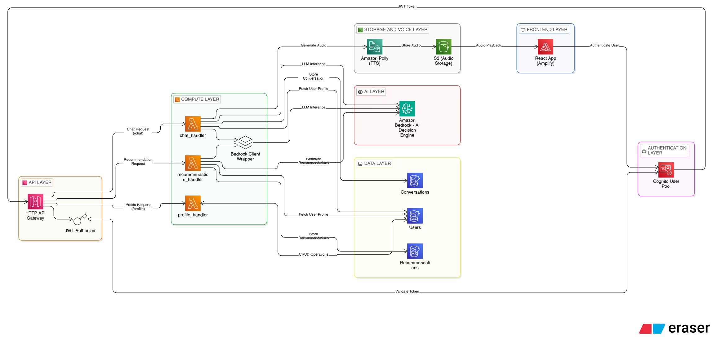
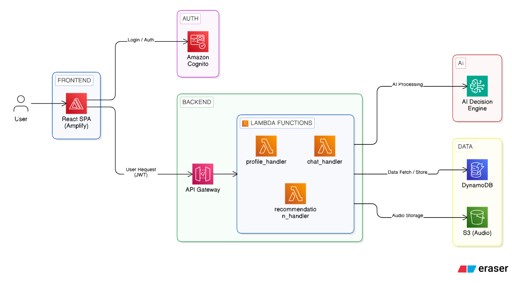

# ET AI Concierge — Hackathon Submission

## 1. Executive Summary
ET AI Concierge is an AI-powered personalization engine for the Economic Times ecosystem. It onboards users in a short conversation, builds a structured financial profile, and delivers personalized ET product recommendations with direct navigation actions.

App Link: https://ethackathon.skillrouteai.com

## 2. Problem Statement
ET has a massive ecosystem (ET Prime, ET Markets, masterclasses, corporate events, wealth summits, and financial services), but users discover only a fraction. We built an AI concierge that understands the user in one conversation and guides them to the right products and services.

## 3. Solution Overview
- Conversational onboarding (3–4 turns)
- Profile extraction + persistence
- Personalized recommendations + action buttons
- Voice input (STT) and optional voice output (Polly)

## 4. System Architecture (High-Level)
Frontend (Vite React SPA)  
→ API Gateway (JWT Authorizer)  
→ Lambda Services  
→ Bedrock AI  
→ DynamoDB (state)  
→ S3 (audio)

## Architecture Diagrams
High-Level System Architecture:



Detailed AWS Architecture:



## 5. Frontend Components
Tech: Vite + React (JS/JSX), Tailwind, shadcn/ui, react-oidc-context

Key UI modules:
- `ChatPage`: onboarding + concierge chat experience
- `DashboardPage`: profile summary + recommendations grid
- `ProfilePage`: user profile view
- `AppShell`: sidebar navigation + top controls
- Voice controls: Web Speech API mic + optional audio playback

## 6. Backend Logic (Lambda)
Tech: Python 3.11, API Gateway HTTP API, DynamoDB, Bedrock, Polly

### `chat_handler` (POST /chat)
- Extracts userId from Cognito JWT
- Loads conversation history + profile from DynamoDB
- Determines onboarding vs concierge mode
- Calls Bedrock with structured JSON prompt
- Persists conversation and optional profile updates
- Optionally synthesizes audio with Polly (`voiceEnabled=true`)

### `profile_handler` (GET/PUT /profile)
- GET: returns profile (auto-creates user on first access)
- PUT: extracts profile from conversation or accepts explicit profile payload

### `recommendation_handler` (GET /recommendations, POST /recommendations/refresh)
- GET: returns stored recommendations or defaults
- POST: calls Bedrock to generate personalized recommendations

### `bedrock_client` (Lambda Layer)
Shared Bedrock wrapper with:
- JSON-structured prompts
- JSON validation and retries
- Decimal-safe serialization for DynamoDB data

## 7. AI Logic (Bedrock)
AI responsibilities:
- Profile extraction
- User classification
- Recommendation generation
- Action generation

Output format: strict JSON with fields like:
`reply`, `user_type`, `actions[]`, `profile_update`

## 8. Data Layer (DynamoDB)
Tables:
1. **Users**
   - `userId`, `email`, `profile`, `onboardingComplete`, timestamps
2. **Conversations**
   - `userId`, `conversationId`, `messages[]`, `updatedAt`
3. **Recommendations**
   - `userId`, `recommendations[]`, `generatedAt`

## 9. API Contract
Base URL: `https://{api-id}.execute-api.{region}.amazonaws.com/prod`

- `POST /chat`
  - Body: `{ "message": "...", "conversationId": "optional", "voiceEnabled": false }`
- `GET /profile`
- `PUT /profile`
  - Body: `{ "conversationId": "..." }` or `{ "profile": {...} }`
- `GET /recommendations`
- `POST /recommendations/refresh`

All endpoints require JWT in `Authorization: Bearer <token>`.

## 10. End-to-End Flow
1. User logs in via Cognito Hosted UI
2. Frontend calls `GET /profile`
3. If onboarding incomplete, chat collects profile data
4. Profile stored in DynamoDB
5. Recommendations generated and shown on dashboard
6. Returning user gets concierge mode + actions

## 11. Scalability & Reliability
- Stateless Lambdas auto-scale
- DynamoDB on-demand
- Bedrock abstracts model scaling
- Polly failures do not block chat replies

## 12. Security
- Cognito JWT authorizer on all routes
- userId derived from JWT `sub`
- No hardcoded secrets, env vars only

## 13. Setup (Local)
```bash
cd frontend
npm install
npm run dev
```

## 14. Deployment
- Backend: `backend/template.yaml` (SAM)
- Frontend: AWS Amplify
- Required env vars:
  - `VITE_API_BASE`
  - `VITE_COGNITO_USER_POOL_ID`
  - `VITE_COGNITO_CLIENT_ID`
  - `VITE_COGNITO_DOMAIN`
  - `VITE_REDIRECT_URI`


## Design Decisions
- Serverless Lambda: scalable and cost-efficient
- Bedrock: managed LLM without infrastructure overhead
- DynamoDB: fast, flexible schema for AI data
- Structured output: predictable system behavior

## Core Innovation
Unlike traditional chatbots, the AI does not only respond. It performs actions by navigating users across the ET ecosystem via structured action payloads.


