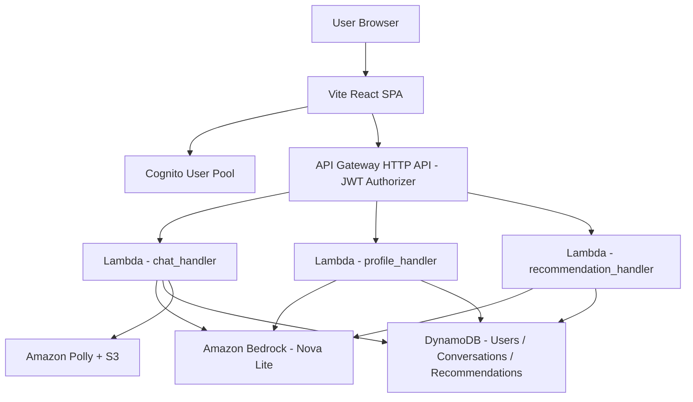
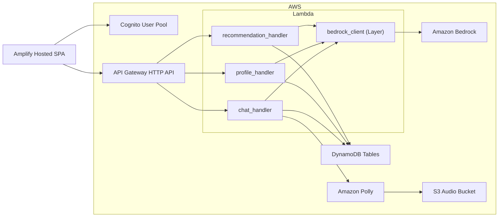
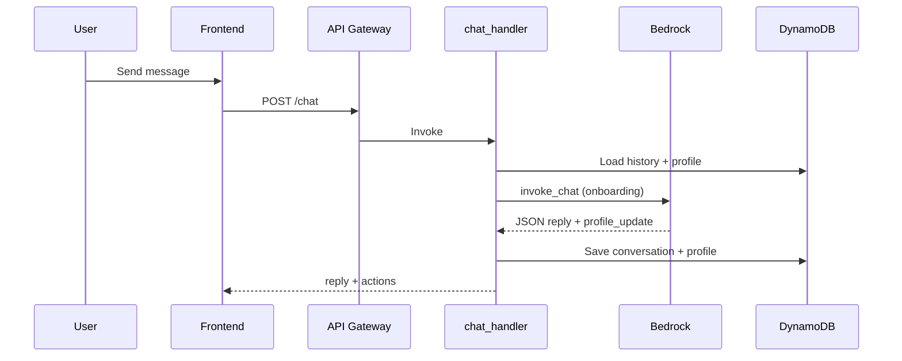
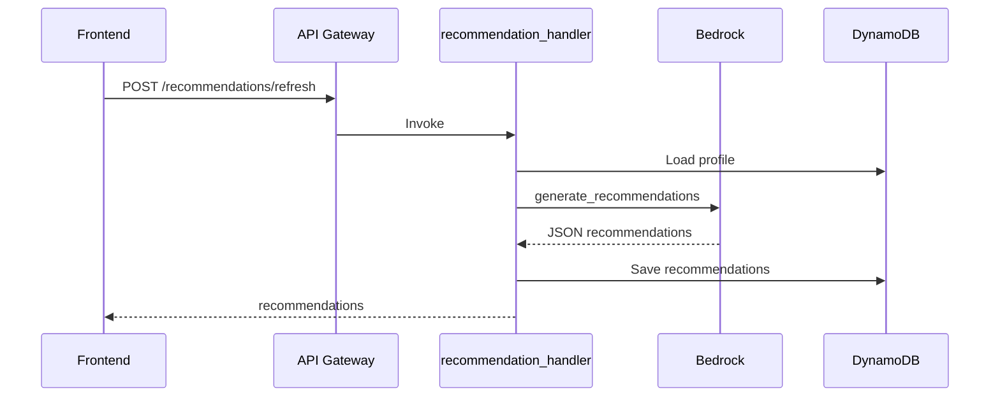

# System Design: ET AI Concierge

## Problem Statement (Hackathon)
ET has a massive ecosystem (ET Prime, ET Markets, masterclasses, corporate events, wealth summits, financial services). Most users discover only a small fraction. Build an AI concierge that understands the user in one conversation and guides them to the right ET products and services.

## Solution Overview
ET AI Concierge is a full-stack, serverless AI system. It onboards users through a short chat, extracts a structured financial profile, and returns personalized recommendations and navigation actions. The architecture is designed for fast onboarding, secure personalization, and scalable inference.

## High-Level Architecture

## AWS Architecture Diagram

## Key Components
### Frontend
- Vite + React (JS/JSX), Tailwind, shadcn/ui
- Auth via `react-oidc-context` using Cognito Hosted UI
- Chat, Dashboard, Profile, and ET product pages
- Web Speech API for STT; Polly URL playback for TTS

### Backend
- `chat_handler`: chat orchestration, profile updates, optional Polly audio
- `profile_handler`: profile retrieval + extraction from conversation
- `recommendation_handler`: personalized recommendations
- `bedrock_client` Lambda Layer: Bedrock calls + JSON validation

## Key Flows
### Onboarding Flow

### Recommendations Flow

## Data Model
- Users: `userId`, `email`, `profile`, `onboardingComplete`
- Conversations: `userId`, `conversationId`, `messages[]`, `updatedAt`
- Recommendations: `userId`, `recommendations[]`, `generatedAt`

## API Summary
- `POST /chat`
- `GET /profile`
- `PUT /profile`
- `GET /recommendations`
- `POST /recommendations/refresh`

## Scalability & Reliability
- Stateless Lambdas scale horizontally
- DynamoDB on-demand for throughput spikes
- Bedrock abstracts model scaling
- Fail-safe: if Polly fails, text response still returned

## Security
- Cognito JWT authorizer on all routes
- UserId derived from JWT `sub` claim
- No hardcoded secrets; env vars only
