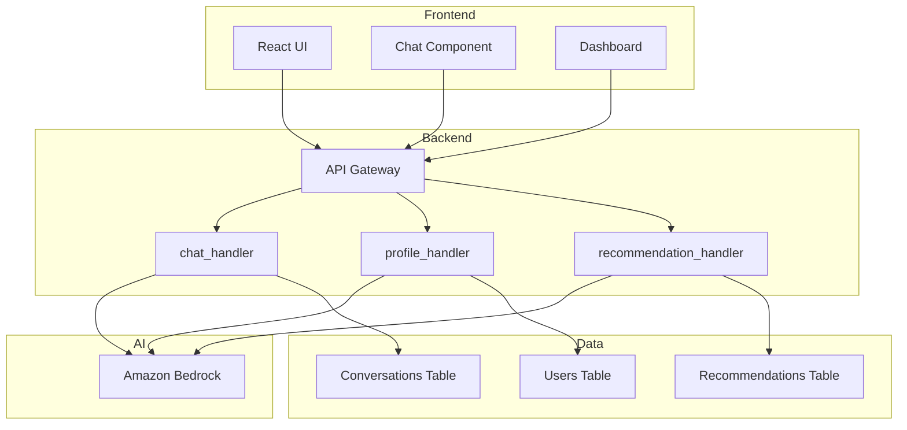
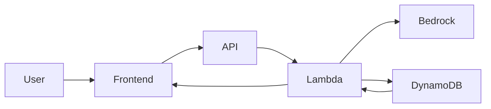
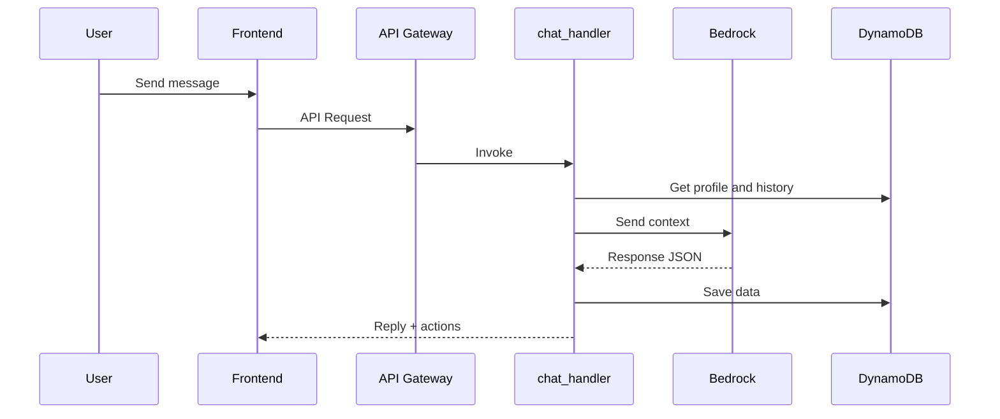
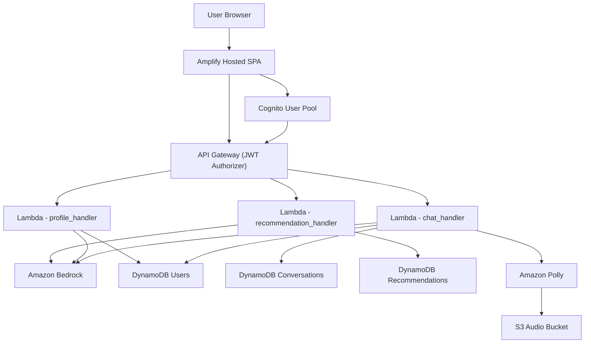

# System Design: ET AI Concierge (Advanced)

## 1. System Overview
ET AI Concierge is a serverless, AI-driven personalization platform that turns user conversations into a guided journey across the Economic Times ecosystem. It performs onboarding, profile extraction, recommendation generation, and action-based navigation.

## 2. Layered Architecture (Enterprise Style)
Presentation Layer
- React SPA (Amplify)
- Chat UI + Dashboard + Navigation

Application Layer
- API Gateway (routing + JWT validation)
- Lambda functions (business logic)

Intelligence Layer
- Amazon Bedrock (LLM)
- Prompt orchestration + structured output

Data Layer
- DynamoDB (state management)
- S3 (audio + assets)

## 3. Component Diagram (UML)

## 4. Detailed Data Flow (UML)

## 5. Request Lifecycle
Chat Request Flow
1. User sends message
2. Frontend -> API Gateway
3. API Gateway -> chat_handler
4. chat_handler loads profile + history, calls Bedrock, builds structured response
5. Persist messages + optional profile update in DynamoDB
6. Return reply + actions to frontend

## 6. AI Decision Logic (Expanded)
The AI system performs a four-step reasoning pipeline:
1. Profile extraction: identify profession, goals, experience, income, risk
2. User classification: label the user segment for personalization
3. Recommendation generation: produce ET product/service suggestions
4. Action mapping: convert recommendations into navigation actions

## 7. Sequence Diagram

## 8. AWS Architecture (Detailed)

## 9. Scalability Design
- Stateless Lambdas scale horizontally
- DynamoDB on-demand for bursts
- Bedrock managed inference scaling
- API Gateway handles concurrency

## 10. Security Design
- Cognito JWT authentication
- API Gateway authorizer
- IAM roles for service access
- No hardcoded secrets

## 11. Key Design Decisions
- Serverless: scalable and cost-efficient
- Bedrock: managed LLM without infra overhead
- DynamoDB: flexible schema for AI data
- Structured output: predictable system behavior

## 12. Core Innovation
Unlike traditional chatbots, this system does not only respond. It performs actions by navigating users across ET products using AI-generated, structured action payloads.

## 13. Future Architecture
- Multi-agent orchestration
- Vector DB for memory and RAG
- Real-time financial data integration
